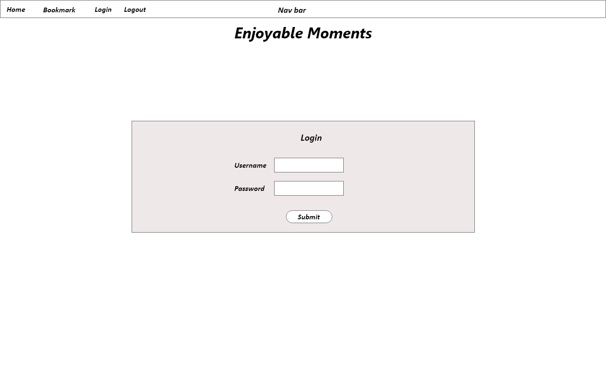
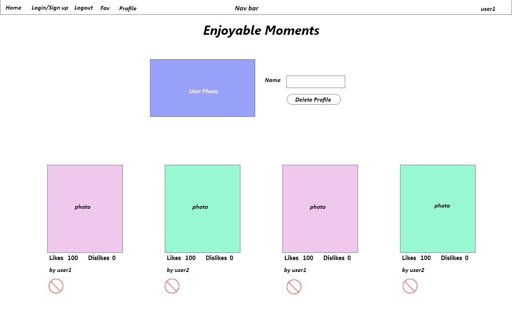

# React-Photo-App

# Wireframe

### Home

### Edit-Comment

### Bookmark

### Login

### Profile

# 
# Features
## Technology: SCSS for styling
## Photo grid is displayed in descending sort order of likes.
## Logging in/out for a user
## Home page shows photo grid.
## Thick red border indicates liked by logged in user
## Thick grey border idnicates disliked by logged in user 
### Clicking on photo brings up comments.
### Clicking on thumbup "likes" the photo above.
### Clicking on thumbdown "dislikes" the photo above.
### Clicking on hearts bookmark the photo above.
### Clicking on circle with a cross deletes the photo above.
### User can add comments for a photo.
### Only logged in user can add comments
### Bookmarks shows the photos bookmarked by the user
### Profile shows user's name, photo, and photos.
### Likes a photo, increments count and add to user's likes list, also removes from dislikes list.
### Dislikes a photo, decrements count and add to user's dislike list, also removes from likes list.
### Bookmark a photo, adds to user's bookmark list.
### Deleting a photo, removes the photo from all users' likes list, dislikes list. 
### Deleting a comment on a photo, also removes it from all users likes list and dislikes list.
### Deleting a user/profile, also deletes all photo's owned by him.
