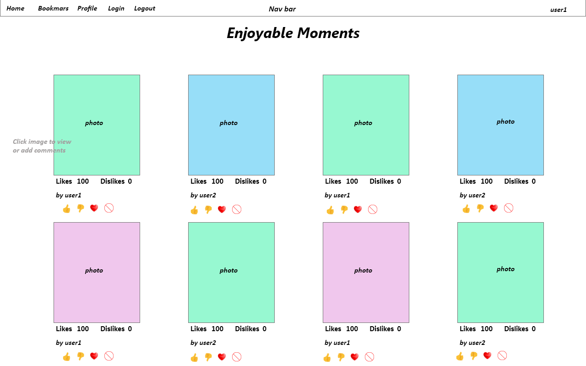
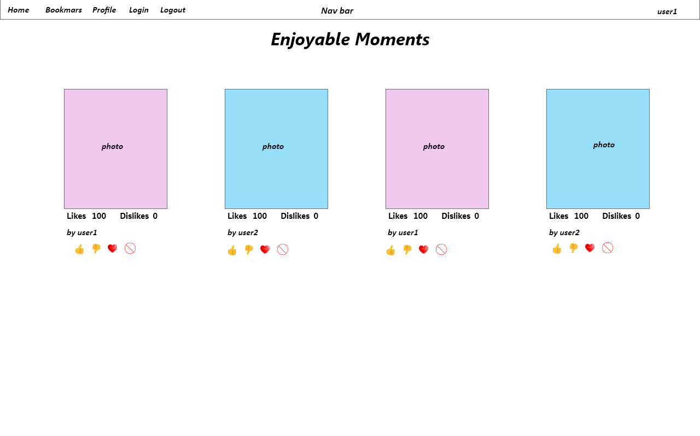

# React-Photo-App

# Wireframe

### Home

### Edit-Comment

### Bookmark

### Login

### Profile

# 
# Featuers
## Attempt using Redux for maintaining logged in user id
## Logging in/out for a user
## Thick red border indicates liked by logged in user
## Thick grey border idnicates disliked by logged in user 
## Clicking on photo brings up comments.
### User can add comments for a photo.
### Only logged in user can add comments
### Bookmarks shows the photos bookmarked by the user
### Profile shows user's name, photo, and photos